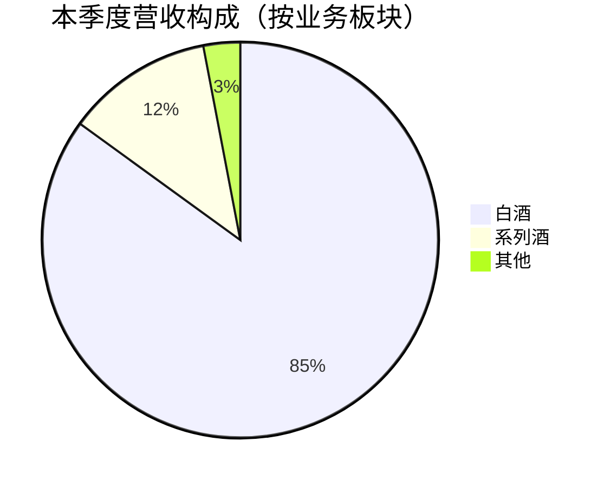

# Equity Earnings Analysis - 参考资料

## 概述

本目录包含 `equity-earnings-analysis` skill 的参考资料和模板文件，用于支持上市公司季度/年度财报分析报告的生成。

## 目录结构

```
references/
├── templates/
│   └── earnings-report-template.md  # 财报分析报告标准模板
└── README.md                        # 本文件
```

## 模板使用说明

### earnings-report-template.md

这是财报分析报告的标准模板，包含以下章节结构：

1. **篇首定调** - 法律声明、芒格语录、核心提要
2. **整体经营表现** - 核心业绩陈述、经营趋势图表
3. **细分业务拆解** - 业务板块分析、市场板块分析
4. **财务质量分析** - 费用、盈利、收益质量、风险、资本开支、股东回报
5. **总结与展望** - 概括总结、未来展望、市场担忧、下季度关注点
6. **估值** - 预测模型、合理估值、机会成本

### 模板变量说明

模板中使用 `{变量名}` 格式的占位符，需要在生成报告时替换为实际数据：

| 变量名 | 说明 | 示例 |
|-------|------|------|
| `{公司名称}` | 分析公司的全称 | 贵州茅台 |
| `{股票代码}` | 公司股票代码 | 600519 |
| `{交易所}` | 上市交易所 | 上交所 |
| `{期间}` | 财报期间 | 2025Q3 / 2025年度 |
| `{报告日期}` | 报告生成日期 | 2026-03-29 |
| `{数据截止日期}` | 财报数据截止日期 | 2025-09-30 |
| `{分析者}` | 报告撰写者 | 文剑 |

## 图表规范

### Mermaid 图表

本模板使用 Mermaid 语法生成图表，支持以下类型：

#### 1. 趋势复合图（xychart-beta）

用于展示营收与净利润的历史趋势：

```mermaid
xychart-beta
    title "营收与净利润趋势（过去10个季度）"
    x-axis [2024Q1, 2024Q2, 2024Q3, 2024Q4, 2025Q1, 2025Q2, 2025Q3, 2025Q4, 2026Q1, 2026Q2]
    y-axis "金额（亿元）" 0 --> 500
    y-axis "同比增长率（%）" -20 --> 60
    bar [200, 220, 240, 280, 260, 290, 310, 350, 340, 380]
    bar [40, 45, 50, 60, 55, 62, 68, 75, 72, 82]
    line [15, 10, 12, 18, 20, 15, 14, 16, 12, 18]
    line [12, 8, 15, 20, 18, 12, 10, 15, 8, 14]
```



#### 2. 业务构成饼图（pie）

用于展示业务板块收入占比：



## 数据来源规范

### 财务数据优先级

1. **公司官方财报**（最高优先级）
   - A股：巨潮资讯网、上交所、深交所公告
   - 美股：SEC.gov（10-K、10-Q文件）
   - 港股：港交所披露易

2. **权威金融数据平台**
   - Wind、同花顺、东方财富
   - Bloomberg、Reuters

3. **分析师一致预测**
   - 必须为最近三个月内更新
   - 需注明预测机构和更新时间

## 与 equity-initial-analysis 的区别

| 维度 | equity-initial-analysis | equity-earnings-analysis |
|------|------------------------|--------------------------|
| 定位 | 首次投资分析 | 财报跟踪分析 |
| 时间跨度 | 过去10年历史数据 | 过去10个季度 + YTD数据 |
| 核心焦点 | 护城河、商业模式、长期价值 | 经营变化、业绩驱动、短期趋势 |
| 财务数据口径 | 年度口径 | YTD（本财年累计）口径 |
| 估值深度 | 完整估值模型 | 快速估值更新 |

## 版本历史

| 版本 | 日期 | 更新内容 |
|-----|------|---------|
| 1.0 | 2026-03-29 | 初始版本 |

---

*本 README 遵循 equity-earnings-analysis skill 规范*