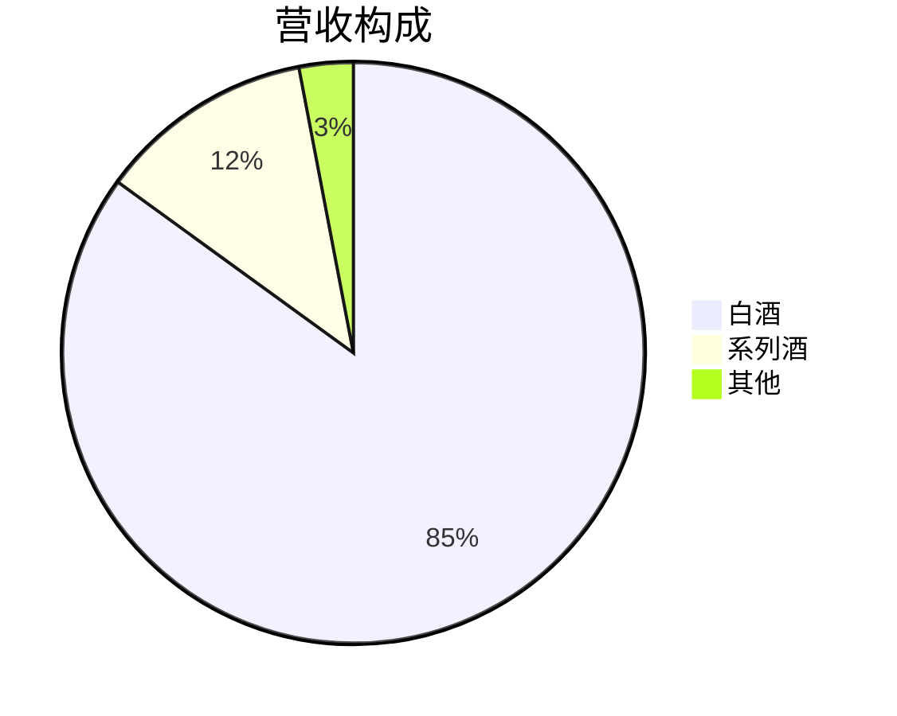

# Equity Earnings Analysis - 参考资料

本目录包含财报分析报告的模板文件，详细规范见 `../skill.md`。

## 目录结构

```
references/
├── templates/
│   └── earnings-report-template.md  # 财报分析报告标准模板
└── README.md
```

## 模板章节

1. 整体经营表现
2. 细分业务拆解（业务板块 / 各业务分析 / 市场板块）
3. 财务质量分析（费用、盈利、收益质量、风险、资本开支、股东回报）
4. 总结与展望
5. 估值

## 模板变量

| 变量名 | 说明 |
|-------|------|
| `{公司名称}` | 分析公司的全称 |
| `{股票代码}` | 公司股票代码 |
| `{期间}` | 财报期间，如 2025Q3 |

## 图表规范

模板使用 Mermaid 语法，支持趋势图（xychart-beta）和饼图（pie）。



## 数据来源

- 公司官方财报（最高优先级）
- 权威金融数据平台
- 分析师一致预测（三个月内更新）

---

| 版本 | 日期 | 更新内容 |
|-----|------|---------|
| 1.1 | 2026-04-09 | 精简结构，引用主规范文件 |
| 1.0 | 2026-03-29 | 初始版本 |

*本 README 遵循 equity-earnings-analysis skill 规范*
