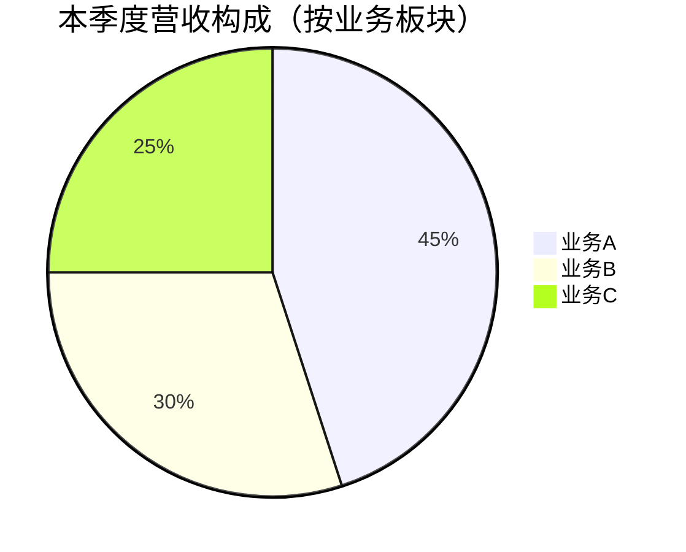

# Equity Earnings Analysis (财报跟踪分析)

## 核心定位与原则

### 分析核心
秉持巴菲特与芒格的投资体系，透过财务数字看背后的"生意本质"，评估企业的确定性与竞争地位。

### 三大核心原则

1. **真实性优先**：强调对非经常性损益（如税收调整、资产计提）的剥离，还原企业真实的经营现金流和净利润。

2. **前瞻导向**：不仅分析滞后指标（营收/利润），更需挖掘领先指标（如RPO、预收款、活跃用户）。

3. **数据驱动决策**：所有分析结论必须有数据支撑，关键数据需注明权威来源。

---

## 适用场景

- 对某家上市公司指定季度财报进行分析（如：2025年第三季度）
- 对某家上市公司指定年度财报进行分析（如：2025年年度）
- 跟踪已关注企业的最新经营表现
- 评估企业季度/年度业绩变化与驱动因素

## 使用说明

1. 提供待分析上市公司的名称或股票代码
2. 明确指定分析的财报类型和期间（如：2025Q3季报、2025年年报）
3. 如有特定关注点，可一并说明

---

## 报告结构规范

### 第一章：篇首定调

#### 1.1 法律声明
固定模板，明确本文仅供交流，不构成投资建议，强调独立思考。

> **免责声明**：本报告仅供交流学习使用，不构成任何投资建议。报告中的观点、数据和结论仅代表作者个人观点，不保证其准确性和完整性。投资者应独立思考和判断，自行承担投资风险。股市有风险，入市需谨慎。

#### 1.2 芒格语录
统一引用芒格关于"看懂生意"的语录，作为全篇分析的灵魂。

> 从根本上来说，还是要看懂一家公司的生意，清楚一家公司面临哪些威胁、拥有哪些机遇、竞争地位如何等。只看过去的业绩增长情况、过去的资本收益率、过去的销售额，难以准确地预测公司的未来。只有在深入了解生意的基础上，才能比较准确地预测公司的前景。做投资，还是要真把生意看懂了。

#### 1.3 核心提要
一句话概括本季度/年度财报的核心特征，作为报告标题式的开篇。

**示例**：
- "营收稳健增长，利润大超预期，云业务成为新引擎"
- "增收不增利，营销费用失控，短期承压待拐点"

---

### 第二章：整体经营表现（Overview）

#### 2.1 核心业绩陈述

**第一段落要求**：

首先明确陈述本财报季中被分析企业的营收和归母净利润增长的关键特征，随后列出营收和归母净利润的具体数据。

**数据呈现要求**：
- 营收：绝对金额、同比变化（百分比和增量）
- 归母净利润：绝对金额、同比变化（百分比和增量）
- **non-GAAP优先**：如归母净利润有non-GAAP数据，优先引用non-GAAP数据，并简要说明与GAAP的关键差异
- **一次性费用还原**：若涉及重大一次性费用，需增加显性还原后的"真实净利润"进行补充陈述
- **年度视角**：如果本季度是财年最后一个季度，则在分析中增加全年度的数据与视角

**标准化描述格式**：
```
营收同比大增XX%（或XX亿元）至XX亿元
归母净利润同比增长XX%至XX亿元
```

#### 2.2 经营趋势图表

**图表要求**：使用Mermaid图表展示过去10个季度（含本季度）的经营趋势。

**复合图构成**：
- **柱状图**：表示营收和净利润数据
- **折线图**：叠加表示营收和净利润的同比增长率

**Mermaid示例**：

```mermaid
xychart-beta
    title "营收与净利润趋势（过去10个季度）"
    x-axis [2024Q1, 2024Q2, 2024Q3, 2024Q4, 2025Q1, 2025Q2, 2025Q3, 2025Q4, 2026Q1, 2026Q2]
    y-axis "金额（亿元）" 0 --> 500
    y-axis "同比增长率（%）" -20 --> 60
    bar [200, 220, 240, 280, 260, 290, 310, 350, 340, 380]
    bar [40, 45, 50, 60, 55, 62, 68, 75, 72, 82]
    line [15, 10, 12, 18, 20, 15, 14, 16, 12, 18]
    line [12, 8, 15, 20, 18, 12, 10, 15, 8, 14]
```


> **图表说明**：柱状图采用叠加显示，底层柱为营收，上层柱为净利润。两条折线分别表示营收同比增长率和净利润同比增长率。

---

### 第三章：细分业务拆解（Segment Analysis）

#### 3.1 业务板块营收分析

##### 3.1.1 总体概述

**第一段要求**：
给出不同业务板块本季度和年度（如果是财年最后一个季度）的营收、占比以及高度概括后的经营结果。

**数据表格**：
| 业务板块 | 本季度营收（亿元） | 同比增长 | 占总营收比例 | 年度营收（亿元） | 年度同比增长 |
|---------|------------------|---------|------------|----------------|-------------|
| 业务A | | | | | |
| 业务B | | | | | |
| 业务C | | | | | |
| 合计 | | | | | |

##### 3.1.2 业务板块饼图

使用Mermaid饼图直观展示各业务板块的收入占比：



##### 3.1.3 各业务逐一分析

**范围要求**：主要业务收入合计占比应大于80%

每个业务一个自然段落，必须包含以下内容：

**(1) 营收数据**
- 子业务本季度营收：绝对金额、同比变化、占总营收比例
- 年度数据（如果是财年最后一个季度）

**(2) 增长驱动力分析**
- 本季度子业务营收增长（或减少）的主要驱动力
- 每个驱动力的阐述格式：
  - **一句话总结**：简明扼要概括
  - **详细原因说明**：深入分析
  - **数据/证据来源**：支撑论据

**(3) 未来增速与增长驱动力**
- 未来增速预测：来自权威渠道的分析师一致预测
- **时效要求**：引用的一致预测数据应为最近三个月内更新
- **必须**：明示引用来源

#### 3.2 市场板块营收分析

用一个独立自然段落阐述，内容包括：

**数据要求**：
| 市场区域 | 本季度营收（亿元） | 同比增长 | 占总营收比例 | 年度营收（亿元） | 年度同比增长 |
|---------|------------------|---------|------------|----------------|-------------|
| 市场A | | | | | |
| 市场B | | | | | |
| 市场C | | | | | |
| 合计 | | | | | |

**分析要点**：
- 各市场营收增长（或减少）的主要原因
- 核心市场与波动较大市场的重点关注

---

### 第四章：财务质量分析

**重要说明**：本章节所有利润表及现金流指标均采用**截止本季度末的本财年口径（Year-to-Date, YTD）**。

#### 4.1 费用支出分析

**分析要求**：
- 本财年累计（YTD）的总费用支出情况
- 分项费用支出分析：研发费用、营销和销售费用、一般及行政费用

**数据表格**：
| 费用项目 | YTD金额（亿元） | 同比变化 | 营收占比 | 去年同期占比 |
|---------|---------------|---------|---------|-------------|
| 研发费用 | | | | |
| 营销和销售费用 | | | | |
| 一般及行政费用 | | | | |
| 费用合计 | | | | |

**分析要点**：
- 费用率变化趋势
- 费用结构优化或恶化
- 对同比变化较大的部分进行深度原因分析

#### 4.2 盈利能力分析

**分析指标**（均为YTD口径）：
| 指标 | 本财年YTD | 去年同期YTD | 同比变化 |
|-----|---------|-----------|---------|
| 毛利率 | | | |
| 运营利润率 | | | |
| 净利率 | | | |
| ROE（年化） | | | |
| ROA（年化） | | | |

**分析要点**：
- 盈利能力变化趋势
- 毛利率变动的驱动因素（价格、成本、结构）
- 运营效率改善或恶化

#### 4.3 收益质量分析

**核心指标**：净现比（YTD口径）

**计算公式**：
```
净现比 = 经营活动现金流净额 / 归母净利润
```

**分析要求**：
- 通过净现比评估企业利润的"含金量"
- 确保利润有充足的现金流支撑
- 分析净现比高低的原因（应收账款、存货、预收款等）

**判断标准**：
- 净现比 > 1：利润质量较高，现金流充沛
- 净现比 < 1：利润质量存疑，需深入分析原因

#### 4.4 财务风险分析

**基准时点**：截止季度末时点

**核心指标**：
| 指标 | 数值 | 说明 |
|-----|------|------|
| 有息负债规模（亿元） | | |
| 有息负债组成 | | 短期借款、长期借款、债券等 |
| 利息支付金额（亿元） | | YTD口径 |
| 利息覆盖倍数 | | EBIT / 利息支出 |
| 净现金规模（亿元） | | 现金及等价物 - 有息负债 |

**分析目的**：确保企业生存安全

#### 4.5 资本开支评估

**分析内容**（YTD口径）：
| 指标 | 本财年YTD | 去年同期YTD | 同比变化 |
|-----|---------|-----------|---------|
| 资本开支（亿元） | | | |
| 经营净现金流（亿元） | | | |
| 自由现金流（亿元） | | | |
| 资本开支/经营净现金流 | | | |

**分析要点**：
- 资本开支规模、原因和主要投向
- 基于经营净现金流、自由现金流的压力测试
- 资本开支的必要性与回报预期

#### 4.6 股东回报分析

**分析内容**（YTD口径）：
| 指标 | 本财年YTD | 去年同期YTD |
|-----|---------|-----------|
| 股息支付金额（亿元） | | |
| 股票回购金额（亿元） | | |
| 股东回报合计（亿元） | | |
| SBC成本（亿元） | | |
| 回购/SBC比例 | | |

**分析要点**：
- 通过股息和回购返还股东的总额
- 对比同期累计SBC（员工股权激励）成本
- 评估股份稀释的回购抵消效果

---

### 第五章：总结与展望

该部分分为四个自然段落：

#### 5.1 概括总结

基于上述分析，对公司本季度/年度财报表现进行总结，并对公司"护城河"受损或拓宽进行定性判断。

**护城河判断标准**：
- 护城河拓宽：竞争优势强化，市场地位提升
- 护城河稳定：竞争优势维持，市场地位稳固
- 护城河受损：竞争优势弱化，面临挑战

#### 5.2 未来展望

**内容要求**：
- 对公司整体未来增速（营收与净利润）的预测
- 核心增长驱动力陈述

**数据要求**：
- 使用权威渠道分析师一致预测数据
- 引用的一致预测数据应为最近三个月内更新
- 明示引用来源

#### 5.3 市场担忧

**思考角度**：从逆向角度思考（尤其是在市场表现相反时）

**分析要点**：
- 潜在问题与风险
- 市场可能忽视的负面因素
- 竞争对手的威胁

#### 5.4 下季度关注点

**内容要求**：
- 列出下季度需要重点关注的指标和事件
- 关键观察点的前瞻指引

---

### 第六章：估值

#### 6.1 预测模型选择

| 模型 | 适用企业类型 | 方法说明 |
|-----|------------|---------|
| 模型1 | 成长性企业 | 基于CAGR预测，理想买点为合理估值的50% |
| 模型2 | 周期性企业 | 席勒估值法（过去十年归母净利润平均值），理想买点为合理估值的70% |

#### 6.2 估值计算（三个段落）

##### 第一段：未来第三年归母净利润预测

**"未来第三年"定义**：以报告生成时的当前年份为起点计算的第三年
- 示例：报告日期为2026年3月，则"未来第三年"为2028年

**成长性企业（模型1）**：
采用权威渠道的分析师一致性预测数据：
- 未来（至少3-5年）的营收复合增长率
- 未来第三年的营收预测
- 未来第三年的归母净利润预测

**周期性企业（模型2）**：
采用过去十年归母净利润的平均值

##### 第二段：合理估值与理想买点

**计算公式**：
- **未来第三年合理估值** = 归母净利润 × 25
- **未来第三年合理股价** = 合理估值 / 总股本
- **理想买点**：
  - 模型1（成长性企业）= 未来第三年合理估值的 50%
  - 模型2（周期性企业）= 未来第三年合理估值的 70%

##### 第三段：机会成本测算

**计算公式**：
```
预期CAGR回报率 = (三年后的合理估值 / 当前市值)^(1/3) - 1
```

**目的**：计算持有该股票的预期年化收益率，与机会成本进行对比

---

## 语言风格与叙事特征

### 基调要求

1. **客观冷静**
   - 基于专业的、数据驱动的分析语境
   - 但在陈述中应不乏幽默诙谐的表述（例如：不再让厨师手抖放盐）

2. **数据表达**
   - 使用"同比大增XX%（或XX亿）至XX亿"的标准化描述
   - 提供直观的增量感受

3. **对比思维**
   - 通过与被分析企业的主要竞争对手或业界标杆企业进行对比
   - 校准分析对象的相对位置

4. **逻辑递进**
   - 采用"由于...导致...反映出..."的严密论证逻辑
   - 在逻辑转折处预留 [Image X] 标识，确保图文并茂

---

## 数据来源要求

### 美股财报数据获取优先级

当分析对象为美股上市公司时，应优先通过 `equity-financial-fetch` skill 获取财报数据：

1. **首选**：使用 `equity-financial-fetch` skill 调用 StockAnalysis 工具获取 SEC API 官方数据
2. **备选**：当 skill 不可用时，通过 Web 搜索获取 Yahoo Finance、Seeking Alpha 等平台数据

**调用方式**：
```
请使用 equity-financial-fetch skill 获取 {股票代码} 的财报数据
```

### 财务数据
- **优先**：公司正式发布的财报数据（如美股企业应采集自SEC.gov中的标准化数据）
- 交易所公告

### 非财报数据
- 权威机构的数据

### 预测数据
- 分析师一致预测（需为最近三个月内更新）
- 明确标注预测来源和更新时间

---

## 分析师预测数据获取规范

### 两步法获取流程

采用两步法获取高质量的分析师一致性预测数据，确保预测的权威性和准确性。

#### 第一步：识别预测权威性TOP3机构

在获取预测数据之前，首先识别过往对被分析公司预测**权威性和准确性**排名前三的机构。

**评估维度**：
| 维度 | 说明 |
|-----|------|
| 预测准确度 | 历史预测值与实际值的偏差程度 |
| 覆盖持续性 | 对该公司的跟踪覆盖时长 |
| 报告质量 | 分析深度和逻辑严谨性 |
| 市场影响力 | 报告发布后的市场反应 |

**数据来源**：
- **国际**：Bloomberg、Reuters的机构排名，TipRanks、MarketBeat等第三方评级
- **国内**：东方财富Choice、同花顺iFinD的机构评分，朝阳永续等

#### 第二步：基于TOP3获取一致性预测数据

以第一步识别的TOP3机构为基础，获取其发布的一致性预测数据。

**必含数据项**：
| 预测项目 | 说明 |
|---------|------|
| 未来3-5年营收CAGR | 营收复合增长率预测 |
| 未来第三年营收预测 | 绝对金额（亿元） |
| 未来第三年归母净利润预测 | 绝对金额（亿元） |
| 预测更新日期 | 必须为最近三个月内 |

**时间基准**：
- **"未来第三年"定义**：以报告生成日期为起点计算的第三年
- 示例：报告生成日期为2026年3月，则"未来第三年"为2028年
- 注意：不是以最近财报年份为基准，而是以当前投资决策时点为基准

**输出格式要求**：

在报告中必须明示以下信息：

| 信息项 | 要求 |
|-------|------|
| TOP3机构名称 | 列出三家机构的正式名称 |
| 各机构关键预测数据 | 营收CAGR、营收预测、净利润预测 |
| 一致性预测值 | TOP3的加权或简单平均值 |
| 数据更新日期 | 每个预测数据的更新时间 |

**示例展示格式**：
```
预测机构TOP3：中金公司、中信证券、华泰证券

| 预测项目 | 中金公司 | 中信证券 | 华泰证券 | 一致预测 |
|---------|---------|---------|---------|---------|
| 未来3-5年营收CAGR | 15% | 12% | 14% | 13.7% |
| 2028年营收预测（亿元） | 500 | 480 | 490 | 490 |
| 2028年归母净利润预测（亿元） | 100 | 95 | 98 | 97.7 |
| 数据更新日期 | 2026-03-15 | 2026-03-10 | 2026-03-12 | - |
```

---

## 质量检查清单

生成报告前，请确认：

- [ ] 所有章节完整输出
- [ ] 财报期间明确标注（季度或年度）
- [ ] YTD口径数据正确
- [ ] 分析师预测数据在三个月内
- [ ] 所有关键数据已注明来源
- [ ] Mermaid图表语法正确
- [ ] 估值计算公式正确
- [ ] 机会成本已计算
- [ ] 护城河判断有明确结论

---

## 输出规范

### 输出文件要求

所有分析报告必须输出为 Markdown 文档，便于存档、版本管理和后续查阅。

### 文件命名规则

**季度财报**：
```
{股票代码}_{公司名称}_季报_{年份}Q{季度}_{YYYYMMDD}.md
```

**年度财报**：
```
{股票代码}_{公司名称}_年报_{年份}_{YYYYMMDD}.md
```

**示例**：
- `600519_贵州茅台_季报_2025Q3_20260329.md`
- `0700_腾讯控股_年报_2025_20260329.md`
- `AAPL_苹果_季报_2025Q4_20260329.md`

### 输出文件存放位置

报告应输出至用户指定目录，如未指定，建议存放至：
```
~/investment-reports/earnings-analysis/
```

### 文档元数据要求

报告开头必须包含 YAML front matter 元数据区：

**季度报告**：
```yaml
---
title: {公司名称}{年份}Q{季度}财报分析报告
stock_code: {股票代码}
stock_name: {公司名称}
exchange: {交易所}
report_type: 季报
fiscal_period: {年份}Q{季度}
report_date: {报告日期}
data_cutoff_date: {数据截止日期}
analyst: {分析者}
version: 1.0
tags: [财报分析, 季报, {年份}]
---
```

**年度报告**：
```yaml
---
title: {公司名称}{年份}年度财报分析报告
stock_code: {股票代码}
stock_name: {公司名称}
exchange: {交易所}
report_type: 年报
fiscal_period: {年份}
report_date: {报告日期}
data_cutoff_date: {数据截止日期}
analyst: {分析者}
version: 1.0
tags: [财报分析, 年报, {年份}]
---
```

### 报告模板

使用 `references/templates/earnings-report-template.md` 提供的标准模板生成报告，确保：
- 章节结构完整
- 格式统一规范
- 数据来源明确标注

---

## 文件结构

```
equity-earnings-analysis/
├── skill.md              # 本文件（包含完整分析规范）
├── scripts/              # Python工具脚本（预留）
└── references/           # 参考资料与模板
    ├── templates/
    │   └── earnings-report-template.md  # 财报分析报告模板
    └── README.md
```

## 注意事项

- 本skill仅供交流学习，不构成投资建议
- 分析需要基于权威数据源，所有数据需注明来源
- 分析师预测数据应为最近三个月内更新
- 本skill专注于单季度或单年度财报分析，不适用于跨期对比分析